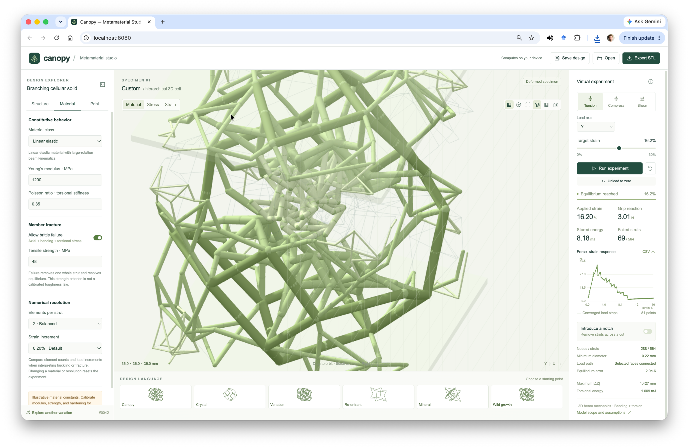

# Canopy — Metamaterial Studio

**3D hierarchical metamateiral design, mechanics, experiments, and fabrication**

Canopy turns a cellular and branching design language into editable volumetric lattices. Design hierarchical unit cells, assemble finite specimens, run displacement-controlled beam simulations, compare recorded experiments, replay fracture, and export printable STL geometry.

The application runs entirely on your computer. Three.js, the numerical solver, meshing, data compression, and the MP4 encoder are included.**




[Quick start](#quick-start) · [Features](#features) · [Physics](#physics-and-interpretation) · [Development](#development) · [Documentation](#documentation) · [GitHub upload](#upload-to-github)

## Quick start

Clone this repository, then move to the directory. With Python 3:

```bash
python3 start.py
```

Or with Node.js 18 or later:

```bash
node serve.mjs
```

Open **http://localhost:8080**. The Python launcher also opens your browser automatically. Keep the terminal open; press **Ctrl+C** to stop.

| Platform | Alternative launcher |
| --- | --- |
| macOS | `Start_Canopy.command`, or the terminal command above |
| Windows | `py -3 start.py`, or `Start_Canopy.bat` |
| Linux | `python3 start.py` or `node serve.mjs` |

If port 8080 is occupied, use `CANOPY_PORT=8081 python3 start.py` on macOS/Linux. In PowerShell, run `$env:CANOPY_PORT=8081` followed by `py -3 start.py`. The Node server uses the same variable.

Both launchers bind to the local computer. Use the HTTP address above: directly opening `dist/index.html` as a file prevents modules and workers from running correctly. WebGL2 provides the orbitable 3D view; a projected canvas fallback is available when WebGL2 is unavailable.

## Features

| Area | Capabilities |
| --- | --- |
| Spatial design | Kelvin, octet, diamond, and re-entrant families; named organic and ordered presets; seeded disorder and nested hierarchy |
| Assembly | Independent dimensions, XYZ cell counts and repeats, shared seam nodes, anisotropy, and thickness gradients |
| Experiments | Tension, compression, shear, selectable load axis, three axial material classes, element subdivision, and load increments |
| Failure | Adjustable discrete notch, tensile member-failure criterion, progressive whole-strut deletion, and re-equilibration |
| Inspection | Stress/strain fields, cutaway, replay, saved recordings, and 1×–100× displacement amplification |
| Results | Automatic experiment records, rich summary metrics, response curves, comparison plots, and collection reset |
| Export | Design JSON, CSV, complete dataset ZIP import/export, replay files, PNG views, and silent H.264 MP4 |
| Fabrication | Fused STL, round/square/reinforced-junction profiles, deformed export, adjustable mesh budgets, and adaptive simplification |

<video src="assets/deformation.mp4" width="100%" controls>
  Your browser does not support the video tag.
</video>

### Start to experiment

1. Choose **Canopy** in the design presets. Adjust the Structure controls and rotate the cell.
2. Choose a material in **Material**. Start with linear elasticity and a small target strain.
3. Select **Tension**, choose the axis, and press **Run experiment**. Inspect force, energy, convergence, and fields.
4. Inspect recorded states with replay. **Displacement scale**, below the measurement tiles, magnifies deformation without changing physical results.
5. Open **Results** to compare runs. Export a complete data ZIP for backup or transfer.
6. Use **Print → Export STL** to prepare geometry, then inspect dimensions and mesh quality in your slicer.

Load the small presets in `examples/designs/` using **Open**. These contain settings, not completed recordings. See the [user guide](docs/USER_GUIDE.md) for detailed controls.

## Physics and interpretation

Spatial nodes have three translations and three rotations. Circular beam elements resist axial deformation, bending in both transverse planes, and torsion. The director-based beam energy is solved using exact first derivatives, a sparse quasi-Newton iteration, and an energy line search under displacement-controlled, quasi-static loading.

Material classes are linear elastic, incompressible Neo-Hookean axial, and elastoplastic axial with isotropic hardening. Bending and torsion remain elastic for all classes. Brittle failure deletes a whole parent strut when its tensile principal-stress estimate exceeds the selected strength, then resolves equilibrium at the same displacement.

| Quantity | Unit or definition |
| --- | --- |
| Geometry / STL | Millimeters |
| Reaction | Newtons |
| Modulus / stress | MPa = N/mm² |
| Energy | mJ = N·mm |
| Stored strains | Fractions; the UI commonly displays percent |
| Nominal stress | Grip reaction divided by initial specimen envelope area |

This is a reduced-order slender-beam model. It omits self-contact, inertia, shear deformation, solid-junction stresses, plastic bending/torsion, and calibrated crack energetics. Failure and work-density metrics are exploratory measures, not validated fracture-toughness predictions. Replay duration is not physical time.

Print thickening and square/reinforced profiles modify fabrication geometry after the circular-beam solve. They are not automatically included in calculated stiffness. Calibrate constituent properties and compare discretization and load increments before making quantitative claims about printed specimens. Full equations and limitations are in [METHODS.md](docs/METHODS.md).

## Data, replay, and practical limits

- Results use browser IndexedDB. Storage is specific to the browser and origin, including its port. Use **Results → Export data** before moving installations. **Reset experiment** retains the collection; **Reset results** clears it.
- Complete dataset ZIPs preserve replay payloads. JSON alone preserves scalar records without binary replay sequences.
- Replay records up to 128 MiB or 10,000 states per experiment; scalar measurements can continue after the recording budget is reached. MP4 output supports 480p, 720p, and 1080p.
- Raw STL budgets default to 8 million triangles / 128 million grid samples, adjustable to 16 million / 512 million. These limits apply before simplification; available memory still matters.
- XYZ cell and repeat counts allow up to 64 combined boxes. Hierarchy and numerical subdivision can still create large systems.

## Repository layout

| Path | Purpose |
| --- | --- |
| `dist/index.html`, `dist/style.css` | Interface and styling |
| `dist/src/` | Editable JavaScript: geometry, mechanics, workers, replay, results, and fabrication |
| `dist/vendor/`, `dist/assets/` | Bundled runtime dependencies, notices, and reference image |
| `tests/` | Numerical, geometry, storage, replay, export, and control checks |
| `scripts/` | Validation and reproducible example/report generators |
| `examples/designs/` | Small importable design and experiment presets |
| `docs/` | User guide and technical specifications |
| `third_party/source/` | Corresponding encoder component sources |
| `.github/workflows/check.yml` | Automated validation and tests |

**Track `dist/` in Git.** It contains the authored, unbundled source and ready-to-serve assets, not disposable build output. Edit `dist/src/` directly and refresh the browser. No separate source tree or compiled application bundle is missing.

Generated movies, STLs, recordings, plots, and reports are omitted from this code distribution. Their generators remain included and their output directories are ignored. Hosting project metadata and credentials are excluded.

## Development

Node 24 is selected in `.nvmrc` and CI; the application package declares Node 18 or later. From the repository root:

```bash
npm start
npm run check
```

`npm run check` runs source validation and the existing test suite. To run either separately:

```bash
npm run validate
npm test
```

There are no npm dependencies to install. Runtime libraries and the test-only IndexedDB implementation are vendored. If FFmpeg and ffprobe are installed, the movie test additionally decodes and inspects its generated MP4.

Checks cover material laws, beam energy derivatives, analytical deformation, rigid-motion invariance, connectivity, notches, STL topology, simplification, recording, replay controls, displacement display, datasets, and storage. Numerical checks are not physical specimen validation. See [CONTRIBUTING.md](CONTRIBUTING.md).

### Generate examples

Run these optional commands from the repository root. They create fresh results in ignored output directories; the first also regenerates tracked design presets:

```bash
node scripts/generate-examples.mjs
node scripts/generate-research-examples.mjs
node scripts/mesh-benchmark.mjs
```

The research generator creates `examples/research/Canopy_Example_Experiments.zip`; load it through **Results → Import data**. The mesh benchmark creates an STL and measurement JSON. Generation can take substantially longer than source validation.

To create the optional report and plots after `generate-examples.mjs`, install Matplotlib in a Python environment and run:

```bash
python3 -m pip install matplotlib
python3 scripts/make-report.py
```

Python packages are not required to launch the app.

## Documentation

- [User guide](docs/USER_GUIDE.md)
- [Spatial beam physics](docs/METHODS.md)
- [Adaptive meshing](docs/MESHING.md)
- [Replay and MP4](docs/REPLAY.md)
- [Experiment data and metric definitions](docs/EXPERIMENT_DATA.md)
- [Legacy planar mechanics](docs/legacy-planar/METHODS.md)
- [Changelog](CHANGELOG.md)
- [Third-party notices](THIRD_PARTY.md)

## Upload to GitHub

Create an empty repository. Upload the **contents of the extracted `canopy-metamaterial-studio` folder**, so `README.md`, `package.json`, `dist/`, and `tests/` are at the repository root. Include the dotfiles and `.github/` directory. Do not upload the ZIP itself as the source tree.

Use GitHub Desktop or Git. Replace `YOUR-ACCOUNT` with the repository owner before running the remote command:

```bash
git init -b main
git add .
git commit -m "Initial Canopy Metamaterial Studio source"
git remote add origin https://github.com/YOUR-ACCOUNT/canopy-metamaterial-studio.git
git push -u origin main
```

The included workflow runs checks on pushes and pull requests. The static serving directory is `dist/`; local operation needs no hosting provider.

## License

Application code retains its [MIT license](LICENSE). Third-party components retain their licenses and source notices; see [THIRD_PARTY.md](THIRD_PARTY.md). The reference image remains subject to its existing rights and is not relicensed by the application license.
